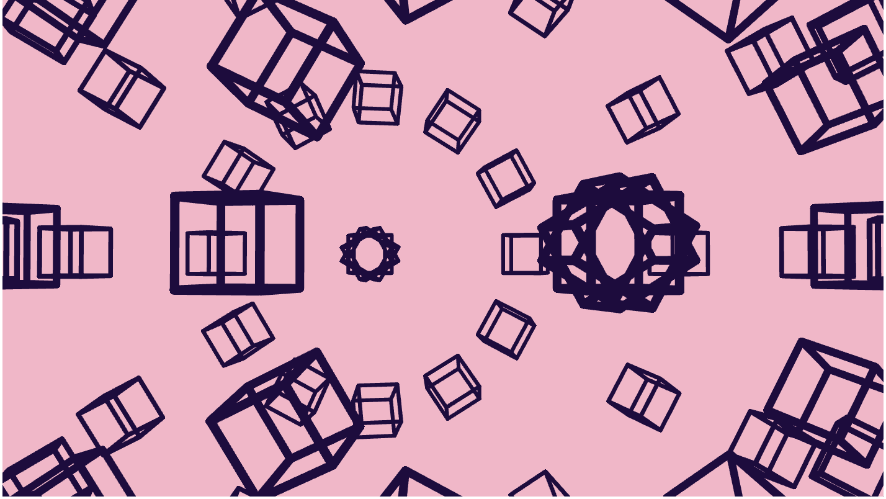

# Quiz 8

## Imaging Technique Inspiration
#### 3D Geometric Visualization

I was inspired by the 3D spatial geometry in the game Monument Valley. The game is based on the geometry of optical illusions, which allows players to rotate and move different building structures that appear to be two-dimensional, but through interaction actually reveal complex three-dimensional geometry.

Monument Valley uses this geometric imaging technology to create visual illusions and spatial distortions that create a unique gaming experience. The architectural design in the game breaks the traditional geometric rules by means of perspective switching and spatial reconstruction, so I want to apply 3D spatial geometric imaging technology to my project.
  

## Image

## Coding Technique Exploration

##### 3D Spatial Geometry Exploration Inspired by *Monument Valley*

## Overview
This project draws inspiration from the 3D spatial geometry found in the game *Monument Valley*. The game utilizes optical illusions within geometric structures, allowing players to interact with seemingly two-dimensional designs that reveal complex three-dimensional forms.

## Coding Technique

Track control adjusts camera orientation in 3D sketches using mouse or touch input. The js 3D orbitControl() function facilitates interactive manipulation of the 3D environment. By allowing users to rotate and zoom in on objects, this technique enhances the hallucinatory effects and spatial transformations seen in Monument Valley. 

Implementing orbitControl() allows for dynamic exploration of geometric shapes, creating an engaging experience that transcends traditional geometric rules.
This coding technique effectively brings the illusion and immersive quality of 3D geometry to life, reflecting the captivating visual experience of * Monument Valley *.

## Example Implementation

- **Link to example**: [p5.js 3D Orbit Control](https://p5js.org/examples/3d-orbit-control/)

## Visual Reference

